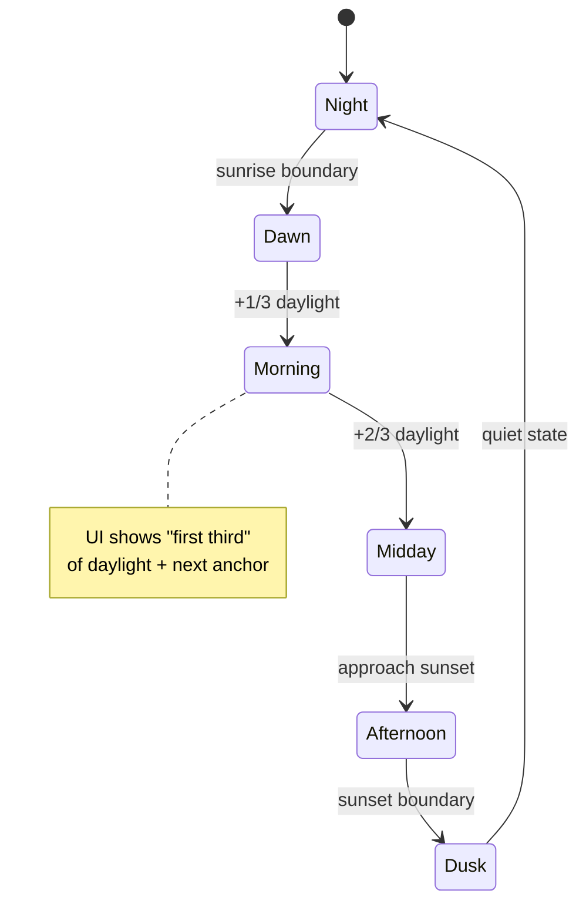

# Product Vision Research Report for Meditamer on Inkplate 4 TEMPERA

## Executive summary

Meditamer’s product opportunity is real, but it has a blunt constraint: many “serious” silent and mindfulness retreats explicitly require participants to surrender **all electronic devices** (phones, smartwatches, etc.) and to avoid reading/writing/journaling during the retreat. citeturn28view0turn28view2 That means a personal, interactive “companion device” cannot be assumed usable *during* these retreats unless it is (a) formally provided/approved by the retreat organization as part of the environment, or (b) aimed at **pre-retreat preparation** and **post-retreat integration** (plus “home retreat days”), and at retreat formats that actually allow tools (many yoga retreats and self-directed digital-detox getaways do). citeturn17search13turn17search0turn20view0turn28view0turn28view2

Inkplate 4 TEMPERA is unusually well-matched to “slow-life UX” because it is (1) e-paper (glanceable, static, low-energy between updates), (2) square 600×600 (excellent for *non-clock* time metaphors like arcs and radial rhythms), and (3) built as an all-in-one device with RTC, battery fuel gauge, sensors, buzzer, touchscreen, microSD, and Wi‑Fi/BLE. citeturn22view0turn23search12turn11view1turn8view0turn8view1 The hardware also creates hard UX rules: touch is disabled during refresh cycles, and partial refresh is fast but can accumulate ghosting—so the UI must avoid “chatty” redraw patterns and schedule occasional full refresh cleanups. citeturn8view0turn22view0turn12search2turn12search6turn16view0

**Core product definition (recommended):** Meditamer is a calm, e-ink “daily rhythm instrument” that helps users (a) rehearse retreat-like routines at home, (b) hold a retreat schedule lightly without compulsive time-checking, and (c) bring retreat behaviors back into ordinary life. For strict device-banning retreats, Meditamer’s “retreat mode” is primarily for **before/after** the retreat and for organizations/facilitators (e.g., a shared schedule board), not for individual participants. citeturn28view0turn28view2

**MVP recommendation:** ship an offline-first, ultra-low-interruption experience: Sun‑Arc time (optional digits), a small set of session timers, a daily rhythm view (schedule blocks), and a minimal reflection capture that does not become a journaling app. Store locally (microSD) and keep Wi‑Fi off by default. citeturn22view0turn11view1turn12search3turn21search1turn21search12

**Assumptions (explicit):**
- No fixed price target was provided; this report treats Meditamer as a “premium calm device” where usability > BOM minimization.  
- Battery capacity is treated as **1200 mAh** per Inkplate 4 TEMPERA documentation; real usable capacity will vary by cell quality, age, and temperature. citeturn22view0turn11view1turn23search12  
- Manufacturing constraints are unknown; recommendations include both “software-only on Inkplate” and “future custom hardware variant” paths.
- “Used on retreats” is treated as **conditional** on retreat rules and organizer consent; strict silent retreats often prohibit devices. citeturn28view0turn28view2

## Retreat contexts, routines, and target users

### Retreat schedules vary from “bell-driven discipline” to “anti-timetable”
Retreats cluster into two operational styles that directly shape Meditamer’s role:

**Bell-driven, tightly structured retreats** (high intensity, silence, long practice blocks):  
- A Goenka-style Vipassana 10-day course timetable starts at **4:00 am** and ends around **9:30 pm**, with alternating sit/walk practice blocks, meals, discourse, and lights out. citeturn28view0turn28view1  
- Many residential mindfulness retreats (example: IMS Retreat Center) run roughly **5:30 am–10:00 pm**, alternating sitting and walking meditation with meals, talks, and a work-as-practice period. citeturn28view2  
These formats often explicitly ban outside communication and require depositing phones and other electronics. citeturn28view0turn28view2

**Low-structure or “anti-timetable” digital-detox retreats** (self-directed time, fewer fixed sessions):  
- Some digital detox retreats explicitly reject schedules and alarms: “there is no program,” “no wake-up alarms,” activities are optional/spontaneous, and phones may be locked away on arrival. citeturn20view0  
This style is tailor-made for non-clock metaphors like sun-arc time.

### Comparative schedule table
The table below focuses on *rhythm* (anchors + intensity) rather than attempting exhaustive timetables for every retreat lineage.

| Retreat type | Example source | Structure | Typical wake / lights-out | Primary anchors | Device policy implications for Meditamer |
|---|---|---|---|---|---|
| Silent Vipassana (Goenka) | Goenka tradition code + timetable | Highly structured, long seated practice | 4:00 am / ~9:30 pm | Meditation blocks, meals, evening discourse, Q&A citeturn28view0turn28view1 | Participants must deposit phones/smartwatches/electronics; no reading/writing/journaling devices. Meditamer won’t be allowed as a personal device in many centers. citeturn28view0 |
| Silent mindfulness retreat | IMS Retreat Center typical schedule | Structured, alternating sit/walk, service period | ~5:30 am / ~10:00 pm citeturn28view2 | Sitting/walking, meals, dharma talk, work-as-practice | Strong restrictions: “turn off your cell phones… leave behind laptops…,” and noble silence may include not journaling. Meditamer needs “facility mode” or pre/post use. citeturn28view2 |
| Yoga ashram / teacher training style | Sivananda (daily schedule) | Highly scheduled, devotional + yoga blocks | ~5:30 am / ~10:00 pm citeturn17search0 | Meditation/chanting, asana/pranayama, karma yoga, meals, lectures | Often compatible with a calm schedule tool (if allowed). Meditamer can support “next anchor” and timers without becoming entertainment. citeturn17search0 |
| Yoga & meditation retreat center | Kripalu daily retreat schedules | Moderately structured, choice of sessions | Includes silent breakfast blocks and scheduled sessions citeturn17search13turn17search5 | Yoga, meditation, workshops, meals | More likely to allow devices, but social norms vary. Meditamer must be obviously non-distracting and optional. citeturn17search13turn17search5 |
| Spiritual monastery (Christian monastic) | Monastery visitor schedule pages | Fixed prayer hours + work/meal flows | Anchored by canonical hours and services citeturn17search7turn17search3 | Vigils/Lauds/Vespers etc, Mass, meals, work | Often compatible with a silent, minimal schedule display—especially if it replaces phone time-checking. citeturn17search7turn17search3 |
| Digital-detox retreat | The Offline Club France getaway | Explicitly low structure (“no program”) | No alarms; wake naturally citeturn20view0 | Meals, optional guided meditation/silent walk, nature/creative activities | Ideal fit: Meditamer can serve as a “day shape” guide (sun arc, meals as anchors) without clock obsession. citeturn20view0 |

### Target users and personas
Because demographics are unspecified, the most useful segmentation is by **relationship to structure, silence, and devices**.

**Home-retreat practitioner (“I want a retreat day without apps.”)**  
They want a guided rhythm at home (sit/walk blocks, slow meals, evening reflection) without bringing a phone into the practice container. This maps well to IMS-style and Vipassana-style day structures, but without violating retreat rules because it’s at home. citeturn28view2turn28view0

**Yoga retreat regular (“I have a schedule, I don’t want my phone.”)**  
They value start times, transitions, and practice timers, but do not want Slack, email, or social media. Sivananda-like schedules are predictable and can be represented as anchors. citeturn17search0

**Digital detox “offliner” (“No clocks, no alarms, no feeds.”)**  
They prefer *unstructured* time but still want a gentle cueing system that prevents drifting into restlessness. This persona benefits most from **sun-arc time** and “anchors without minutes.” citeturn20view0turn18view16

**Monastery guest (“Help me show up for prayer without a smartphone.”)**  
They need a discreet way to know “what’s next” and where the day sits in the prayer/work rhythm—without checking a bright screen. citeturn17search7turn17search3

**Retreat facilitator / center operator (“Make the schedule visible without phones.”)**  
This is the realistic “during strict retreat” user. A shared Meditamer unit can show the day’s rhythm in common areas, replacing wall printouts and reducing participant time-checking behaviors. This aligns with retreats that prohibit personal devices. citeturn28view0turn28view2

## Slow-life behaviors and UX principles that actually produce slowness

### The slowness goal is not “less time,” it’s “less time pressure”
Meditamer should not optimize users for productivity; it should shape attention and perception of time. This strongly aligns with **slow technology** as a design agenda aimed at reflection and mental rest rather than efficiency. citeturn21search12turn21search16

### Core principles to adopt
**Calm, peripheral-first information.**  
Weiser & Brown’s calm technology framing emphasizes moving information between center and periphery of attention so the tech supports life rather than dominating it. citeturn21search1turn21search9 For Meditamer, that means: “always available, rarely demanding.”

**Deliberate friction over instant gratification.**  
Anything resembling variable-reward checking behavior (refresh-to-see-what’s-new, random prompts, streak bait) undermines the product. A retreat companion can’t behave like a slot machine. Calm/slow design intentionally avoids stimulation loops. citeturn21search1turn21search12

**Anchor-based time instead of minute-based time.**  
Retreat life is mostly lived between anchors (gong, meal, session, prayer hour). Goenka-style Vipassana and IMS schedules are anchor-dense but do not require participants to watch minutes; the container does that. citeturn28view0turn28view2 Digital detox retreats may explicitly reject timetables and alarms altogether. citeturn20view0  
Meditamer should therefore default to:
- “Now in the first / second / last third of daylight”
- “Next: meal” or “Next: sit”
- “Time until next anchor” (optional), rather than displaying clock time everywhere.

### A practical “Sun‑Arc” metaphor specification
The sun-arc metaphor is not just a graphic—done right, it becomes a behavior shaper:
- Day is represented as the arc from sunrise to sunset; night is a separate, quieter state.  
- The “now” marker moves continuously, but the screen should not: the marker can be drawn only when the user wakes the device or at coarse intervals (e.g., every 5–15 minutes), keeping updates calm and power-light. citeturn22view0turn12search3turn11view1  
- “Anchors” appear as dots along the arc (meals, sessions, prayers), not as a scrolling list by default. This makes the schedule feel like a day *shape*, not a todo list. citeturn28view2turn17search0turn17search7

### Wellbeing and safety constraints are not “nice-to-haves”
Some retreat organizations explicitly warn that intensive silent retreats may be inappropriate for people currently experiencing severe depression/anxiety/PTSD symptoms and encourage prospective retreatants to assess readiness. citeturn28view2 Meditamer should not gamify intensity (e.g., “longer sits = better”) and should provide easy exits: “Pause / shorten today / switch to grounding.”

## Inkplate 4 TEMPERA capability and constraint analysis

### What the platform can do (relevant to Meditamer)
Inkplate 4 TEMPERA is a compact e-paper device with:
- **Display:** 3.8-inch, **600×600**, 3‑bit grayscale (8 shades), plus a 1‑bit B/W mode. citeturn22view0turn11view1turn23search12  
- **Refresh:** partial refresh ~**0.18s** (1‑bit), full refresh ~**0.86s** (both 1‑bit and 3‑bit, including cleanup). citeturn22view0turn23search2  
- **Touch:** built-in capacitive touchscreen, two-point multitouch; touch is disabled during refresh cycles (very important for interaction design). citeturn8view0turn23search12  
- **Frontlight:** integrated white LED frontlight with **64 brightness levels**, independently controlled; higher brightness increases current draw. citeturn8view1  
- **MCU:** ESP32 dual-core with Wi‑Fi + Bluetooth LE; ESP32 family specs include Xtensa LX6 CPU and internal SRAM/ROM characteristics. citeturn22view0turn26search1  
- **Storage:** microSD slot (excellent for offline-first schedules, assets, logs). citeturn22view0turn11view1turn23search12  
- **Timekeeping:** PCF85063A RTC with backup power support (explicitly listed in multiple Inkplate 4 TEMPERA materials). citeturn22view0turn23search12turn23search2  
- **Sensors:** BME688 (environmental + gas), APDS‑9960 (gesture), LSM6DS3 (gyro/accel). citeturn22view0turn11view1  
- **Audio:** frequency-adjustable buzzer. citeturn22view0turn11view0  
- **Power system:** 1200 mAh Li‑ion battery, battery charger MCP73831, and a fuel gauge BQ27441; deep sleep / low-power mode reported at **18 µA**. citeturn22view0turn11view1turn8view2  
- **Form factor:** ~90×83×24 mm enclosure. citeturn22view0turn11view1

image_group{"layout":"carousel","aspect_ratio":"1:1","query":["Inkplate 4 TEMPERA photo","Inkplate 4 TEMPERA enclosure with glass panel","e-paper touchscreen device 3.8 inch","e-ink display partial refresh ghosting example"],"num_per_query":1}

### What the platform will fight you on
**Strict retreat compliance is the first product constraint, not hardware.**  
Goenka-style Vipassana requires depositing phones, smartwatches, and “other electronic devices,” and prohibits reading/writing devices. citeturn28view0 IMS similarly asks retreatants to leave behind communication devices and explicitly frames noble silence to include not reading/writing/journaling. citeturn28view2  
So: Meditamer’s “retreat relevance” must include **center-provided mode** and **home/pre-post** positioning.

**E-paper interaction is bursty and stateful.**  
Partial updates are fast but can accumulate ghosting; full refresh clears but is slower and more visually disruptive. Pervasive Displays distinguishes global (full) updates from fast/partial and notes different mechanisms (driver-side compare vs host-defined window). citeturn12search2 Pervasive also explicitly recommends managing ghosting via compensation/full refresh strategies. citeturn12search6turn12search9 A TI e-paper reference design similarly frames partial update as a power optimization with a ghosting downside and notes user-forced full refresh to clean artifacts. citeturn16view0turn14view1

**Touch + refresh conflict.**  
Touch input is temporarily disabled during display refresh on Inkplate 4 TEMPERA. citeturn8view0 That means Meditamer must avoid interactions that require rapid “tap-tap-tap” during updates, and must provide clear “busy” affordances.

**Frontlight is a stealth battery killer.**  
Inkplate’s frontlight is great for nighttime reflection, but its own documentation warns to use lower brightness on battery and to consider turning it off when inactive. citeturn8view1 For Meditamer, frontlight must be:
- off by default in day mode,
- manually invoked or ambient-reactive (see sensor strategy later),
- aggressively time-limited.

**Documentation inconsistencies exist (tell-it-like-it-is):**  
Some vendor tables/pages contain conflicting values (e.g., “TOUCHSCREEN No” despite touchscreen documentation and specs; and other inconsistencies across secondary listings). The most reliable sources for your build should be Inkplate 4 TEMPERA’s own datasheet + Soldered documentation + Crowd Supply specs. citeturn22view0turn11view1turn8view0turn23search12

### Development stack implications
Inkplate 4 TEMPERA officially supports Arduino and MicroPython, and has community support for ESPHome. citeturn22view0turn11view1 This matters for product vision because:
- **Arduino** yields fastest prototyping with existing display + touch + power examples.
- **ESP-IDF** offers tighter control over sleep/wake/peripheral power gating (useful if you push multi-week battery goals). Espressif documents deep sleep/light sleep mechanisms and wake sources. citeturn12search3turn26search25  
- A pragmatic plan is: MVP in Arduino/Inkplate libs; v1 performance/power hardening in ESP‑IDF.

## Concrete e‑ink interaction patterns and UI concepts

### Display update strategy as a first-class UX decision
Define three rendering policies and treat them as design primitives:

**Stable screens (default):**  
- “Home / Sun Arc,” “Today Rhythm,” “This Session,” “Evening Reflection.”  
- Render once, then stay static until a deliberate interaction or scheduled boundary.  
This fully exploits e-paper’s low power between updates. citeturn25search21turn22view0

**Micro-updates (partial refresh windows):**  
Use for tiny deltas:
- a moving “now” tick on the sun arc (only on wake or coarse interval),
- countdown minutes (if enabled),
- session progress indicator.  
These should be **windowed** and avoid changing large areas; partial windowing is the established approach for partial updates. citeturn12search2turn22view0turn23search2

**Cleanup cadence (full refresh):**  
Full refresh is your “reset the canvas” tool:
- after N partial updates,
- when switching between heavy-contrast screens,
- after any scribble/handwriting mode,
- on user request (“clean screen”).  
This matches Pervasive and TI guidance that ghosting is mitigated via periodic full refresh. citeturn12search6turn14view1turn16view0

### e‑ink-specific interaction patterns (Meditamer patterns)
**Pattern: “Tap → immediate visual acknowledgment → delayed content redraw.”**  
Because touch can be disabled during refresh, you want to acknowledge input quickly (e.g., invert a tiny button region) and then do the heavier update. Inkplate guidance emphasizes visible touch regions and immediate on-screen feedback, plus debouncing/tap thresholds. citeturn8view0

**Pattern: “Two-step intent for disruptive actions.”**  
Stop session, change mode, enable Wi‑Fi, show clock digits—these should require a confirm gesture (press-and-hold, or “tap again”). This reduces accidental interactions and also reinforces slowness (deliberate friction). citeturn21search1turn21search12

**Pattern: “No feeds. No scrolling by default.”**  
Scrolling implies frequent redraws and invites compulsive behavior. Prefer paging between a small number of stable screens, or radial/overview screens that compress information.

**Pattern: “Frontlight as a ritual tool.”**  
Treat frontlight like lighting a candle: intentional, time-limited, and user-controlled. Inkplate documentation explicitly recommends powering it down when inactive to extend runtime. citeturn8view1

### Accessibility and wellbeing considerations
**Contrast and legibility:**  
Even though e-ink is grayscale, the same minimum contrast principles apply. WCAG 2.2’s contrast minimum guidance (4.5:1 for normal text; 3:1 for large text) is a practical baseline for text and UI components. citeturn21search3turn21search7 On e-ink, you should bias toward:
- large text sizes,
- simple fonts with strong strokes,
- avoiding faint grays for essential information (use grayscale for “secondary ambiance,” not instructions).

**Reduce cognitive load via predictable structure:**  
In calm/slow contexts, unpredictability is a bug. Calm technology emphasizes minimizing attention demand and supporting periphery. citeturn21search1turn21search9

**Wellbeing safety:**  
Since intensive retreat contexts can be psychologically demanding, Meditamer should not push intensity or imply medical benefit; it should offer gentle options (shorten session, grounding exercise, “take a walk”) and default to non-judgmental language. IMS explicitly notes that some conditions (e.g., strong PTSD symptoms) may make silent retreat inappropriate, highlighting the need for caution around intensity framing. citeturn28view2

### UI mockup sketches (square e‑ink layouts)

**Sun‑Arc Home (primary screen)**  
- Minimal text; no seconds; optional hidden clock digits.  
- Anchors shown as dots along arc.

```text
┌──────────────────────────────┐
│            TODAY             │
│                              │
│        .  meal   .           │
│     .                .       │
│   .     (sun arc)      .     │
│  .         ● now         .   │
│   .                  .       │
│     .    session   .         │
│                              │
│   Next: Walking (soon)       │
│   Light: off  |  Wi‑Fi: off  │
│                              │
│  [Start Session]  [Rhythm]   │
└──────────────────────────────┘
```

**Session Timer (low-interruption)**  
- Big progress ring + one-line guidance.  
- Avoid per-second updates; update at coarse cadence or on tap.

```text
┌──────────────────────────────┐
│        SITTING SESSION       │
│                              │
│          ⟳⟳⟳⟳⟳⟳⟳             │
│        ⟳   35 min   ⟳         │
│          ⟳⟳⟳⟳⟳⟳⟳             │
│                              │
│   Phrase: “return to breath” │
│                              │
│ [Pause]   [End]   [Dim light]│
└──────────────────────────────┘
```

**Daily Rhythm (schedule blocks, anchor-first)**  
- Blocks as “day texture,” not a list of appointments.

```text
┌──────────────────────────────┐
│          DAY RHYTHM          │
│                              │
│  Dawn ── Sit ── Breakfast     │
│  Morning ─ Walk ─ Sit         │
│  Midday ─ Lunch ─ Rest        │
│  Afternoon ─ Work/Walk        │
│  Evening ─ Talk ─ Quiet       │
│  Night ── Wind‑down           │
│                              │
│  [Edit] [Templates] [Home]   │
└──────────────────────────────┘
```

### Mermaid diagrams for key flows and metaphors

```mermaid
flowchart TD
  A[Wake / Tap Wake Button] --> B[Sun‑Arc Home]
  B -->|Tap anchor dot| C[Anchor Detail: "Next block"]
  B -->|Tap Start Session| D[Session Setup]
  D --> E[Session Running]
  E -->|End / Auto-finish| F[Short Reflection Prompt]
  F --> B
  B -->|Long-press corner| G[Reveal Clock Digits (optional)]
  G --> B
```



```mermaid
timeline
  title Example "Daily Rhythm" View (Anchor-Based)
  04:00 : Wake (bell / natural)
  06:30 : Breakfast anchor
  12:00 : Lunch anchor
  17:00 : Evening meal / tea anchor
  21:30 : Quiet / lights out anchor
```

## Feature feasibility, power budget mapping, and prioritized roadmap

### Hardware feasibility and power reality check
Meditamer’s biggest power risks are not the e-paper itself; they are **Wi‑Fi** and **frontlight**.

- Inkplate 4 TEMPERA deep sleep is stated at **18 µA**, which is extremely low for an always-available device. citeturn22view0turn11view1turn23search12  
- ESP32 deep sleep at the SoC level is documented on the order of ~10 µA, but board-level current depends on what stays powered. citeturn26search1turn26search25  
- TI’s e-paper reference design measurements illustrate that **partial update reduces update time and energy**, but can create ghosting, so a full refresh is sometimes required; it also notes that temperature effects can lengthen update time, undermining partial-update benefits. citeturn16view0turn14view1  
- TPS65186 (the e-paper PMIC used here) has operating quiescent current specified in the mA range when active, with much lower standby current, implying you should not leave the e-paper power subsystem “fully awake” unless needed. citeturn25search1turn22view0  
- BME688 can be configured down to very low average currents in ULP modes (sub‑0.1 mA average is documented), but higher-frequency gas scanning can be much more power intensive—so environmental sensing must be optional and carefully duty-cycled. citeturn26search3turn26search27

**Practical implication:**  
A “month on a charge” story is plausible only if:
- Wi‑Fi is normally off (sync in rare bursts),
- frontlight is used sparingly,
- the device sleeps aggressively between anchors and only wakes on user interaction or scheduled boundaries. citeturn8view1turn12search3turn22view0

### Feature-to-hardware mapping table
This table is intentionally opinionated: it prioritizes slowness and feasibility over “cool demos.”

| Feature | User value | Inkplate dependencies | E‑ink update pattern | Power impact | Roadmap |
|---|---|---|---|---|---|
| Sun‑Arc Home (optional digits) | Stops compulsive clock-checking; makes day feel spacious | RTC (PCF85063A), display | Stable + micro-updates | Low | MVP citeturn22view0turn23search12turn20view0 |
| Schedule templates (Vipassana/IMS/Yoga/Monastic/Detox) | Fast setup; correct rhythms | microSD storage; UI | Stable | Low | MVP (templates) + v1 (custom editor) citeturn28view0turn28view2turn17search0turn17search7turn20view0 |
| Session timer (sit/walk/yoga/chant) | Retreat-like structure without phone | RTC + touch + (optional) buzzer | Partial window; periodic cleanup | Low–Med | MVP citeturn22view0turn23search2turn8view0 |
| Silent mode (no audio, no digits) | Respect silence, reduce stimulation | Software only | Stable | Low | MVP citeturn28view2turn28view0turn20view0 |
| Minimal reflection capture (“3 words” / checkbox) | Post-session integration without journaling rabbit hole | touch keyboard or gesture UI; microSD | Stable | Low | v1 citeturn28view2turn21search12 |
| Ambient-reactive frontlight | Comfortable night use without fiddling | frontlight + APDS‑9960 (gesture sensor may support light) | Independent | Medium–High | v1 citeturn8view1turn22view0 |
| Rare Wi‑Fi sync (NTP + optional schedule import/export) | Accurate time; easy updates without building an app ecosystem | Wi‑Fi | Stable | High (bursty) | v1 (opt-in) citeturn22view0turn26search1turn12search3 |
| Handwriting journaling / sketching | Nice, but risks making a “tablet” | touch + rapid partial updates | Heavy partial + frequent cleanup | Medium–High | Future / only if mission-critical citeturn12search2turn12search6turn8view0 |
| Facility “Schedule Board Mode” | Makes Meditamer usable inside strict retreats (if approved) | display + RTC; optional Wi‑Fi off | Stable | Low | v1 (B2B angle) citeturn28view0turn28view2 |

### Prioritized roadmap (MVP → v1 → future)

**MVP (the smallest thing that is honestly Meditamer)**  
- Sun‑Arc Home with optional hidden clock digits. citeturn21search1turn22view0turn20view0  
- Prebuilt rhythm templates + simple “edit anchors” (meals/sessions). citeturn28view0turn28view2turn17search0  
- Session timers: sit / walk / yoga / prayer, with silent completion by default (no buzzer unless explicitly enabled). citeturn22view0turn8view0turn28view2  
- Offline-first storage on microSD; Wi‑Fi off by default. citeturn22view0turn11view1  
- A disciplined update policy: partial refresh for tiny regions, full refresh cleanup on context switches. citeturn12search2turn12search6turn22view0

**v1 (make it robust + “daily life” credible)**  
- Ambient-reactive frontlight and an explicit “night ritual” mode. citeturn8view1turn22view0  
- Optional “facility mode” for retreat centers (shared schedule display, no personal data). citeturn28view0turn28view2  
- Time sync + schedule import/export as **manual rituals** (e.g., “sync once per week”), not background automation. citeturn22view0turn26search1turn12search3  
- Battery transparency via fuel gauge (“weeks left” as a calm estimate, not percent obsession). citeturn22view0turn25search8

**Future (only if you want a product line, not just a prototype)**  
- A custom enclosure optimized for one-handed holding + physical navigation controls (see below).  
- A “retreat kit” variant for centers: multiple devices, shared schedule provisioning, tamper-resistant settings. citeturn28view0turn28view2  
- A hardware revision oriented around deeper sleep (more aggressive rail gating) if multi-month battery under real use becomes a core promise. citeturn26search25turn25search1

### Suggested hardware add-ons and trade-offs
Because you’re using Inkplate 4 TEMPERA, many “add-ons” are best treated as **external modules via easyC/Qwiic** or as **enclosure modifications**. Inkplate already includes RTC and frontlight, so the real decisions are about controls, night use, and durability. citeturn22view0turn8view1turn23search12

| Add-on / trade-off | Why it matters for slowness | Feasibility on Inkplate 4 TEMPERA | Cost impact (relative) | Complexity impact (relative) |
|---|---|---|---|---|
| More physical buttons (Back / Home / Start) | Enables eyes-free + slower, deliberate interaction; reduces touchscreen “fiddling” | Moderate: requires enclosure work + GPIO mapping; already has a wake button. citeturn22view0turn8view3 | Low | Medium |
| Haptics (vibration) | Silent session completion without sound; better for shared spaces than buzzer | Needs external motor + driver + enclosure mounting | Medium | High |
| Ambient light sensing | Auto frontlight without “settings thinking” | APDS‑9960 is present; verify usable ALS output; otherwise add easyC light sensor | Low | Low–Med citeturn22view0turn8view1 |
| RTC (already present) | Enables true “clockless UI” (sun arc still needs time) without Wi‑Fi | Built-in PCF85063A | None | None citeturn22view0turn23search12turn26search2 |
| Frontlight (already present) | Night reflection without blue-glare | Built in, 64 levels; must be strict about usage to protect battery. citeturn8view1turn22view0 | None | Low |
| Solar charging | Potentially supports multi-week outdoor detox | Requires panel + charger integration; indoors often disappointing | High | High |

**Durability trade-off:** glass panel vs plastic cover  
Inkplate offers both variants; if you expect use as a carry device on retreats, the glass panel is likely worth it for scratch resistance and perceived “object quality,” but it may increase weight/cost and changes drop behavior (glass can crack). citeturn22view0turn11view1

## Next research steps

Measure and validate what matters instead of guessing:
- **Retreat policy validation:** Interview 8–12 retreat operators across the five retreat types. The question is binary: “Would you allow this device, under what rules?” The Vipassana and IMS-style sources strongly suggest many will say “no” for participants. citeturn28view0turn28view2  
- **Power profiling on real hardware:** instrument deep sleep, wake bursts, frontlight at each brightness level, Wi‑Fi sync bursts, and partial/full refresh energy. Espressif explicitly notes that current measurement is tricky because the current spans µA to mA ranges, so choose proper measurement tooling. citeturn26search25turn22view0turn8view1  
- **Ghosting vs UX study:** prototype the three update policies (stable / micro-update / cleanup cadence) and test readability after typical daily use. Use Pervasive/TI guidance to structure experiments (e.g., N partial updates then forced full refresh). citeturn12search6turn12search2turn16view0  
- **Accessibility testing:** conduct quick checks with low vision users and at least one dyslexia/reading-fatigue participant. Use WCAG contrast heuristics as baseline, but validate against real e-ink contrast behavior and frontlight glare conditions. citeturn21search3turn8view1  
- **Positioning experiment:** test two narratives in landing-page interviews:  
  - “Retreat companion device” (likely blocked by retreat rules), vs  
  - “Bring retreat rhythm into daily life” (likely stronger and more broadly usable). citeturn28view0turn28view2turn20view0