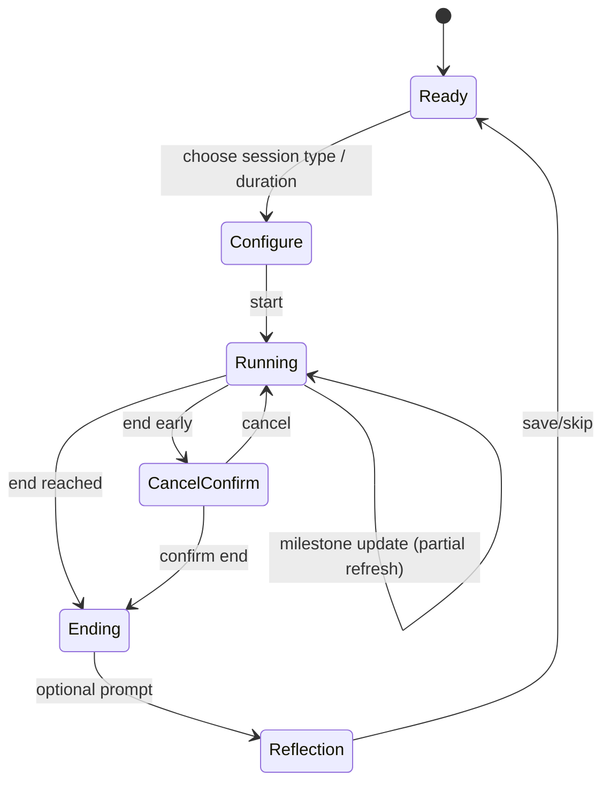

# Meditamer Product Vision on Inkplate 4 TEMPERA

## Executive summary

Meditamer should be positioned as a **permitted “smart timer + gentle rhythm companion”** for retreats (including silent/Vipassana, mindfulness/IMS-style, yoga/ashram, monastic, and digital‑detox formats) and as a **daily slow‑life anchor** at home. The core product promise is **time-awareness without time-pressure**: users stay oriented to the day’s rhythm via **anchors** (bells, meals, sessions, light) and **non-clock metaphors** (sun-arc), while the device avoids the interaction patterns that accelerate attention (feeds, infinite scroll, notification storms). This aligns strongly with “calm technology” principles—moving information from the center to the periphery of attention—while deliberately restricting functionality to protect the retreat container and wellbeing. citeturn17search0turn17search17

Inkplate 4 TEMPERA is unusually well-matched to this product category because it combines a **600×600 grayscale e‑paper touchscreen (3-bit)** with **ultra-low-power sleep (~18 µA)**, **fast partial updates (~0.18 s)**, built‑in **frontlight**, and an unusually rich sensor set (BME688 environmental, APDS‑9960 gesture/proximity/ALS/RGBC, LSM6DS3 IMU) plus **RTC, buzzer, microSD, Wi‑Fi/BLE**. However, these capabilities create a paradox: **connectivity and lighting are the biggest risk vectors** for both retreat acceptability and battery life. The vision should therefore be **offline-first** with an explicit **Retreat Compliance Mode** (radios off by default, no prompts to connect, silent alerts by default, and conservative refresh policies). citeturn21view0turn6view0turn7view0turn20view0

A pragmatic roadmap is:
- **MVP:** a reliable, retreat-friendly smart timer/alarm + schedule templates + sun‑arc home, entirely offline; microSD-backed storage; silent defaults; battery-life validated. (This fits both retreat needs and daily home practice.) citeturn21view0turn20view0turn19view0turn19view1turn18view0  
- **v1:** optional manual sync (user‑triggered Wi‑Fi only), facilitator/shared “session board” mode, ambient-reactive frontlight (prefer built-in ALS via APDS‑9960), and minimal reflection capture. citeturn21view0turn7view0turn26search0  
- **Future:** a custom hardware variant (more physical buttons, haptics, optional solar/charging accessories) and richer journaling/handwriting only if the interaction can remain “slow” on e‑paper.

## Assumptions, scope, and positioning constraints

**Hard assumptions (explicitly used for feasibility and power math):**
- Battery capacity: **1200 mAh** (as specified for Inkplate 4 TEMPERA). citeturn21view0turn20view0turn6view2  
- Deep sleep current for the **Inkplate 4 TEMPERA board**: **~18 µA** (vendor claim). citeturn21view0turn20view0turn6view2  
- Device must work without network access for retreats; Wi‑Fi/BLE presence is treated as a risk and must be controlled at the product layer. citeturn18view0turn19view0turn19view2turn3search2  

**Unknowns (assumptions flagged for verification):**
- Price target, gross margin, and manufacturing constraints are unspecified; this report avoids asserting a BOM-driven retail price for Meditamer (beyond relative add-on complexity).  
- Retreat operator acceptance varies widely; some environments deposit *all* electronics, others allow simple watches/timers. Meditamer must therefore present itself credibly as **a “non-communication timer”** and offer a facilitator-friendly policy posture. citeturn19view0turn19view1turn18view0turn17search3turn3search21  
- Firmware stack choice (Arduino vs ESP‑IDF vs MicroPython) affects power and UX responsiveness; all are feasible on ESP32-class hardware, but power best practices differ. citeturn21view0turn20view0turn23search22  

**Product positioning constraint (tell-it-like-it-is):**
- If Meditamer behaves like “a small phone” (frequent UI changes, frequent prompts, cloud-first, or lots of apps), it will fail both as a retreat tool and as a slow‑life device. The product vision should explicitly reject “general productivity” creep.

## Target users and personas

Meditamer’s target users are defined more by **context and intent** than demographics. Retreat and slow‑life contexts are highly sensitive to *intrusion*, *status*, and *social signaling*, so personas emphasize “what must never happen” alongside needs.

### Persona set

**Home-retreat practitioner (daily anchor user)**  
Motivation: build a stable, gentle habit (morning sit, mid-day reset, evening wind-down) without phone dependence.  
Pain points: phone timer pulls them into notifications; “streaks” and gamified habit apps cause shame or overtraining.  
Meditamer fit: sun‑arc home + 1–3 daily anchors + silent session timers + minimal reflection prompts.  
Key constraint: must work perfectly offline; must not nag.

**Yoga retreat regular (ashram rhythm adopter)**  
Motivation: enjoys structured days (wake bell, satsang, asana, service) and wants to keep that rhythm when traveling and at home.  
Pain points: too many schedule changes become cognitively noisy; wants “what’s next” without micromanaging time.  
Meditamer fit: daily rhythm board (anchors + blocks), optional “practice intention” and gentle bedtime ramp aligned with ashram schedules. citeturn27search2turn27search6turn27search18  

**Digital-detox offliner (anti-notification minimalist)**  
Motivation: wants “offline social permission” and a physical boundary from work.  
Pain points: fear of missing emergencies; anxiety spikes if they can’t tell “where in the day” they are.  
Meditamer fit: no-internet default, “emergency plan” note, time-orientation via anchors and sun arc, not digital time; optional alarm to leave / meals. citeturn3search2turn2search4  

**Monastery guest (rule-respecting visitor)**  
Motivation: enter an established liturgical/work rhythm; needs punctuality without constant clock-checking.  
Pain points: visible devices can feel disrespectful; audible alarms are disruptive.  
Meditamer fit: ultra-minimal “Next Office” board + silent alerts; device can live face-down or on a shelf as a shared board. citeturn27search3turn27search19  

**Silent/Vipassana retreatant (high-discipline container)**  
Motivation: rely on the retreat structure; may want a personal non-phone alarm/watch if allowed.  
Pain points: strict device rules; fear of breaking silence by accidental beeps or flashing.  
Meditamer fit: retreat compliance mode + non-ticking alarms + “no beeps by default.” Many Vipassana centers explicitly advise bringing a simple watch and/or non‑ticking alarm clock while checking in phones/communication devices. citeturn19view0turn19view1turn19view2turn27search24  

**Retreat facilitator (shared display + compliance)**  
Motivation: keep a group on schedule without “clock culture”; reduce repeated questions (“how long until break?”).  
Pain points: schedules vary; wants a calm shared board that doesn’t become a phone proxy.  
Meditamer fit: “Session Board” mode—big readable blocks, silent cues, easy template swapping, optional time hiding.

### Retreat acceptability note: timers and alarms are often permitted, but not universally

- Some centers explicitly **require phones/communication devices to be checked in** and recommend a simple wristwatch and/or **non‑ticking alarm clock**, implying participants can keep non-communication timekeeping. citeturn19view0turn19view1turn19view2  
- Silent retreat environments commonly require that **watches do not beep** and that communication devices are not used. citeturn18view0turn17search3  
- Digital detox retreats typically frame the experience as phone-free/offline, sometimes with minimal or no structured program. citeturn3search2turn2search4  

This supports treating Meditamer as a **permitted smart timer/alarm** (and optionally a facilitator board) *when configured to be non-communicative, silent by default, and visibly “not a phone.”*

## Typical retreat schedules and daily routines

Retreat schedules share a core pattern: **anchors** (wake, meals, talks/offices) and **repeating practice blocks** (sitting/walking, asana, work/service). Meditamer should model the day around anchors and blocks rather than minutes and seconds—while still supporting precise timing for sessions.

### Representative timetable comparison

| Retreat type | Example source (primary) | Structure (what repeats) | Wake / lights-out | Primary anchors | Device policy signals |
|---|---|---|---|---|---|
| Silent/Vipassana (Goenka-style) | “The Course Time Table” (dhamma/VRI) citeturn27search24 | Long meditation blocks + multiple group sittings + meals + evening discourse | ~4:00 am wake; evenings end around ~9:30 pm lights-out (by timetable flow) citeturn27search24 | wake bell, breakfast, lunch, group sits, discourse | Phones/communication devices checked in; some centers advise **simple watch + non‑ticking alarm clock**; smartphones may be explicitly barred as watch/alarm. citeturn19view0turn19view1turn19view2 |
| Mindfulness/IMS-style residential retreat | Insight Retreat Center “A Typical Retreat Day” citeturn27search1 | Alternating ~45‑min sitting and walking; daily instruction + dharma talk; work period | ~6:00 am start; day to ~9:30 pm citeturn27search1 | sitting/walking cycles, meals, talk, work meditation | Silence is typical; retreat culture strongly discourages phones/laptops/communication devices. citeturn17search3turn18view0 |
| Yoga/ashram / teacher-training rhythm | Sivananda daily schedule citeturn27search2turn27search6 | Morning practice + asana + meals + karma yoga/service + lectures + evening practice | ~4:30–5:30 am wake; ~10:00 pm lights out citeturn27search2turn27search6 | satsang/meditation, asana, meals, service, lectures | Typically structured days; device rules vary by site, but schedule is anchor-heavy and supports “what’s next” orientation. citeturn27search18 |
| Spiritual/monastic guest rhythm | Christ in the Desert “Daily Schedule” citeturn27search3 | Canonical prayer offices + mass + work + meals | ~5:00 am Vigils; structured day anchored by offices citeturn27search3 | Vigils, Lauds, Terce, work, meals | Expectation of quiet and punctuality; audible alarms are socially risky; a shared “next office” board is more acceptable than personal beeping devices. citeturn27search3turn27search19 |
| Digital-detox / Offline Club style | Offline Club “Digital Detox Retreats” + example listing “No program… no wake up alarms” citeturn3search2turn2search4 | Often minimal structure; emphasis on permission to be offline and present | Often explicitly *no wake-up alarms* in some formats citeturn2search4 | social meals, optional activities, rest | Phone-free framing; low tolerance for “tech vibes” even if the device is not a phone. citeturn3search2turn2search4 |

### Implications for Meditamer’s “time model”

1. **Retreat time is anchored time.** Users rarely need “10:17”; they need “before breakfast,” “mid‑morning sit,” “until the bell.” This is consistent across Vipassana, insight retreats, and ashram schedules. citeturn27search24turn27search1turn27search6turn27search3  
2. **Precision still matters locally.** Even when clock time is deemphasized, *session timing* (e.g., 30–60 minute sits, alternating blocks) is central. citeturn27search1turn27search5  
3. **Many retreat containers reject communication devices but tolerate silent timekeeping.** That makes “smart timer/alarm” the correct mental model, not “mini tablet.” citeturn19view0turn19view2turn18view0  

## Desired slow-life behaviors and UX principles

Meditamer’s UX should be designed to **shape behavior**: it’s not just a display of time; it is a set of constraints that nudge people toward slowness.

### Principle foundations and what they mean here

**Calm technology (peripheral-first information)**  
Weiser & Brown describe calm technology as shifting between center and periphery of attention, making technology “quiet” in lived experience rather than demanding focus. Meditamer should therefore:
- show the minimum needed to orient,  
- avoid interruption-first design,  
- and make “checking” feel unnecessary. citeturn17search0  

**Slow technology (designing for reflection, not throughput)**  
Hallnäs & Redström define slow technology as a design agenda aimed at reflection and mental rest rather than efficiency. In Meditamer, that translates to:
- fewer actions,  
- slower transitions,  
- and language that supports reflection instead of performance scoring. citeturn17search17turn17search9  

**Anchor-based time and sun-arc metaphor**  
Instead of minute-by-minute domination, time should be represented as:
- **anchors** (wake, meals, practice blocks, lights-out), and  
- **flow** (sun arc progression),  
with digits optional and often hidden. This is especially compatible with retreat timetables. citeturn27search24turn27search1turn27search6  

### Concrete UX rules (non-negotiables)

1. **No feeds, no infinite scrolling, no “content.”** The e‑ink screen must never become a browsing surface.  
2. **Default to “quiet mode” language.** Replace “You completed 3 sessions!” with “A sit happened” or “You were here.” (Avoid gamification loops.) citeturn17search17  
3. **Digits are optional and deliberately subdued.** The primary time view is sun‑arc + anchors; exact time appears only on explicit request (press-and-hold or deep menu).  
4. **Deliberate friction for disruptive actions.** Anything that could break a retreat container—turning on Wi‑Fi, enabling loud buzzer alarms, changing schedules—requires a two-step confirmation and a short cooling delay before applying.  
5. **Coarse updates, stable screens.** Update only at meaningful boundaries (anchor approaching, session start/end) rather than continuous ticking.

### Accessibility, wellbeing, and mental-health safety

Meditamer is not a medical device, but it operates in psychologically sensitive contexts (silence, long sits, fatigue, trauma histories). Retreat providers explicitly note that intensive silent retreat can be strenuous and may not be appropriate during significant depression/anxiety/PTSD or recent trauma; Meditamer should adopt similar caution in its onboarding and language. citeturn18view0  

Key requirements:

- **WCAG-inspired legibility:** Use high contrast, large text options, and avoid low-contrast gray-on-gray UI. WCAG 2.2’s minimum contrast guidance for text (4.5:1 for normal text, 3:1 for large) should inform typography choices even though this is not a web product. citeturn17search6turn17search2  
- **Non-escalating UX:** avoid shame language (“missed,” “failed,” “streak broken”); offer “opt out of metrics.”  
- **Emergency exit:** always provide a single, obvious path to “show me the time” and “stop alarm” without puzzles. (Retreat panic is real; UX should not add friction here.)  
- **Privacy by default:** log locally (microSD) and do not require accounts; if sync exists, it must be strictly opt-in and user-triggered.

## Concrete interaction patterns and UI concepts for e‑ink

E‑ink is ideal for calm, static, always-on screens—but punishes “lively UI.” Meditamer should treat the display like **paper with occasional reprinting**.

### Rendering and update policy

Inkplate 4 TEMPERA specifics that matter:
- Partial refresh: **~0.18 s** (1‑bit mode); full refresh **~0.86 s** (1‑bit and 3‑bit including cleanup). citeturn21view0turn5search3  
- 3‑bit grayscale (8 shades). citeturn21view0turn20view0  
- Touch input is **temporarily disabled during screen refresh** (critical UX constraint). citeturn6view0  

E‑paper update concepts to encode in the design:
- “Global/full update” affects the whole screen.  
- “Fast/partial update” changes only what needs to change (or a defined window), but repeated partial updates can increase artifacts/ghosting and may require periodic cleanup. citeturn8search2turn9search19turn8search29  

**Recommended Meditamer update rules (practical and conservative):**
- **Home (Sun‑Arc) screen:** update at anchor boundaries and on user intent; avoid minute ticking.  
- **Session timer:** avoid continuous second-by-second animation. Instead:
  - show a static remaining-time *phrase* (“about half left”) and  
  - update only at coarse milestones (e.g., every 5 minutes, or at 25/50/75% markers), using partial refresh in a small window.  
- **Full refresh cadence:** do a full refresh at natural breaks (end of session, meal break, bedtime), and when entering/exiting “high-contrast” screens, to manage ghosting risk. citeturn8search2turn9search19  
- **Touch-disabled-during-refresh handling:** treat taps during refresh as:
  - either queued (one deep) and then acknowledged, or  
  - dropped with a visible “refreshing” state; don’t rely on “rapid double taps” as a core interaction. citeturn6view0  

### Input patterns that encourage slowness

Because touch is disabled during refresh and e‑ink updates are expensive, Meditamer benefits from **intentful micro-interactions**:
- **Tap → acknowledge → delayed redraw:** capture the tap, give minimal immediate feedback (e.g., a “dot” or a subtle icon change), then redraw after a short delay (150–400 ms) to avoid thrash.  
- **Two-step actions for disruptive effects:**  
  - turning on Wi‑Fi  
  - enabling loud alarms  
  - changing retreat mode  
  require confirm + wait (“Applying in 10…9… (Cancel)”).  
- **“Hold to reveal digits.”** A long press reveals exact time or numeric countdown, then fades back to metaphor.

### Frontlight rules

Inkplate’s frontlight supports **64 brightness levels** and vendor guidance recommends lower brightness on battery and turning it off during inactivity/deep sleep; higher brightness increases current draw and should be planned in the power budget. citeturn7view0  

Because the APDS‑9960 includes **ambient light sensing (ALS)** and gesture/proximity, a realistic v1 feature is **ambient-reactive frontlight** without additional ALS hardware (subject to calibration because the sensor is side-mounted). citeturn21view0turn26search0  

### Offline-first storage strategy

Inkplate includes microSD storage. Treat it as the canonical store for:
- schedule templates (JSON)  
- user preferences  
- reflection entries (append-only log)  
- cached sunrise tables or last-known location (if used)  
- large bitmaps/fonts (avoid using scarce RAM for assets). citeturn21view0turn20view0turn6view2  

### ASCII mockups of key screens

**Sun‑Arc Home (default)**
```
┌──────────────────────────────┐
│  today                       │
│  (digits hidden)             │
│                              │
│        .  sunrise            │
│     .         .              │
│   .             .            │
│  .      ● now      .         │
│   .             .            │
│     .         .              │
│        .  sunset             │
│                              │
│  next:  sitting (quiet)      │
│  until bell:  ~12 min        │
│  [hold] show clock           │
└──────────────────────────────┘
```

**Session Timer (coarse, calm)**
```
┌──────────────────────────────┐
│  sitting                      │
│  intention: "soften"          │
│                               │
│  remaining:  about half       │
│  ▓▓▓▓▓▓░░░░░░░░               │
│                               │
│  next update: 5 min           │
│                               │
│  [end early]  [pause]         │
│   (two-step)   (rare)         │
└──────────────────────────────┘
```

**Daily Rhythm (anchors, not minutes)**
```
┌──────────────────────────────┐
│  day rhythm                   │
│                               │
│  ○ wake                        │
│  │  sit / walk cycles          │
│  ○ breakfast                    │
│  │  work / rest                 │
│  ○ lunch                        │
│  │  afternoon practice          │
│  ○ tea                          │
│  │  talk / reflection           │
│  ○ lights out                   │
│                               │
│  now: between lunch and tea    │
└──────────────────────────────┘
```

**Minimal Reflection (end-of-session, optional)**
```
┌──────────────────────────────┐
│  session ended                │
│                               │
│  one word?  (optional)        │
│  [ calm ] [ restless ] [ ... ]│
│                               │
│  body:  [open] [tight]        │
│                               │
│  [skip]  [save]               │
└──────────────────────────────┘
```

### Mermaid diagrams (requested)

```mermaid
flowchart TD
  A[Wake / pick up device] --> B[Sun-Arc Home]
  B -->|glance only| C[Return to life]
  B -->|tap "next"| D[Anchor detail: next block]
  D -->|start| E[Session Timer]
  E -->|end| F[Soft chime / silent cue]
  F --> G[Optional Reflection]
  G --> B
  B -->|hold| H[Reveal clock digits]
  H -->|timeout| B
```



```mermaid
timeline
  title Daily Rhythm Anchors (example)
  04:00  Wake bell
  06:30  Breakfast
  11:00  Lunch
  17:00  Tea / break
  19:00  Talk / instruction
  21:30  Lights out
```

## Inkplate 4 TEMPERA capabilities, constraints, and feasibility mapping

### Hardware capability snapshot (what Meditamer can safely assume)

Inkplate 4 TEMPERA is produced by entity["company","Soldered Electronics","electronics maker croatia"] and sold via entity["organization","Crowd Supply","hardware crowdfunding platform"]. The platform combines an ESP32 MCU, a 3.8" 600×600 e‑paper touchscreen, frontlight, sensors, RTC, microSD, and low-power mode. citeturn21view0turn20view0turn6view2  

Key specifications relevant to Meditamer:

- **Display:** 600×600, 3‑bit grayscale, touchscreen, partial refresh (~0.18 s) and full refresh (~0.86 s). citeturn21view0turn5search3  
- **Touch constraint:** touch input temporarily disabled during refresh. citeturn6view0  
- **Compute & memory:** ESP32 with **8 MB flash + 4 MB RAM** (as specified). citeturn21view0  
- **Connectivity:** Wi‑Fi + BLE. citeturn21view0turn20view0  
- **Storage:** microSD slot. citeturn21view0turn20view0turn6view2  
- **Sensors:**  
  - BME688 environmental (temp/humidity/pressure/air quality),  
  - APDS‑9960 gesture/proximity,  
  - LSM6DS3 gyro+accelerometer,  
  - plus RTC (PCF85063A) backed by auxiliary battery. citeturn21view0turn26search0turn26search1  
- **Audio:** frequency-adjustable buzzer. citeturn21view0turn20view0  
- **Power:** 1200 mAh Li‑ion battery, deep sleep ~18 µA; TPS65186-based e‑paper power supply; onboard charger (MCP73831) and fuel gauge (BQ27441). citeturn21view0turn20view0turn4search21turn26search3  
- **Physical:** ~90×83×24 mm; datasheet lists ~147 g for at least one variant; 3D-printed enclosure included. citeturn20view0turn6view2  

Development ecosystem:
- Official support for Arduino and MicroPython is emphasized; ESPHome community support is mentioned. citeturn21view1turn20view0  
- Because this is ESP32 hardware, ESP‑IDF power management and sleep mode APIs are directly applicable (though you still need Inkplate-specific display drivers). citeturn23search22turn24view1  

### Critical constraints (what will bite you if you ignore it)

1. **E‑ink is not for “live UI.”** If you try to do smooth ticking countdowns, progress animations, or many UI changes per minute, you will burn power and create visual artifacts. Use coarse updates. citeturn8search2turn9search19turn8search29  
2. **Touch is disabled during refresh.** So the UI cannot rely on rapid interactions during frequent redraws. Meditamer must treat refresh as a brief “input blackout.” citeturn6view0  
3. **Wi‑Fi and frontlight are the biggest power drains and retreat risks.** The vendor explicitly warns that higher frontlight brightness increases current draw and should be budgeted; Wi‑Fi on ESP-class devices is inherently high draw compared to sleep currents. citeturn7view0turn24view1turn23search14  
4. **Strict retreat optics:** even if the device is technically “just a timer,” if it looks like a phone and has Wi‑Fi, some containers will reject it outright.

### Power budget: orders of magnitude (with explicit assumptions)

**Theoretical deep-sleep-only runtime** (unrealistic upper bound, used to show scale):  
- 1200 mAh / 0.018 mA ≈ **66,666 hours ≈ 2,778 days ≈ 7.6 years**.  
This matches the idea that e‑paper devices can be “always showing” while asleep—because the display doesn’t require power to hold an image and the board current can be microamps. citeturn21view0turn8search29  

**Why real life is lower:**  
- Any wake cycle moves you from µA to **mA ranges**. ESP32 datasheet shows modem-sleep currents on the order of **~20–68 mA** depending on CPU frequency, and deep-sleep behavior depends on configuration (e.g., RTC timer + memory vs ULP). citeturn24view1turn25view1  
- Wi‑Fi transmission is typically **hundreds of mA** on ESP‑WROOM‑32 class modules (and should be treated as “expensive bursts”). citeturn23search14  
- Frontlight brightness increases draw and must be aggressively managed. citeturn7view0  

**Concrete example (illustrative; not a measurement claim):**  
If Meditamer wakes ~120 times/day (e.g., 1 per session milestone + a few interactions), and each wake costs ~2 seconds averaging ~30 mA (CPU on, no Wi‑Fi, minimal computation), daily wake cost ≈ 120 × 2 s × 30 mA = 7200 mA·s/day = 2 mAh/day. Deep sleep adds ~0.43 mAh/day (18 µA × 24h). Total ≈ 2.4 mAh/day → **~500 days** on 1200 mAh. This drops sharply if Wi‑Fi is used even briefly or frontlight is high. The correct next step is to power-profile on real hardware. citeturn24view1turn7view0turn21view0  

### Feature-to-hardware feasibility and power impact

Power impact is rated **Low / Med / High** (relative), with rationale rooted in the platform’s documented behaviors.

| Feature | Hardware dependencies | E‑ink update pattern | Power impact | Why |
|---|---|---|---|---|
| Sun‑Arc Home (metaphor-first) | RTC; optional sunrise calc; display | Few updates/day; partial for “now dot,” full at breaks | Low | Minimal redraw frequency; e‑paper holds image without power between updates. citeturn8search29turn21view0 |
| Schedule templates (retreat types) | microSD storage; RTC | Mostly static; full refresh on template swap | Low | Data is tiny; refreshes are rare. citeturn21view0turn20view0 |
| Session timer (coarse milestones) | RTC; optional buzzer/frontlight | Partial refresh in a small window every N minutes; full at end | Low–Med | More frequent partial refresh; still controlled. Touch blackout during refresh must be handled. citeturn6view0turn21view0turn8search2 |
| Silent alarm (visual/frontlight ramp) | RTC; frontlight | No screen refresh needed; frontlight ramp only | Med | Frontlight increases current draw; needs strict auto-off. citeturn7view0 |
| Audible alarm (buzzer) | Buzzer | No display refresh required | Med | Short buzzer bursts are usually cheaper than Wi‑Fi/frontlight but socially risky in retreats. citeturn21view0turn18view0 |
| Gesture “snooze/ack” | APDS‑9960 | Minimal redraw; partial tiny icon change | Low–Med | Sensor polling can be managed; UI feedback should be minimal. citeturn21view0turn26search0 |
| Ambient-reactive frontlight | APDS‑9960 ALS + frontlight | No extra refresh; adjust brightness slowly | Med–High | Lighting dominates power; ALS helps minimize brightness. citeturn7view0turn26search0 |
| Manual Wi‑Fi sync (user-initiated) | Wi‑Fi; storage | No e‑ink dependency | High | Wi‑Fi is a major draw and a retreat-acceptability risk; must be opt-in and rare. citeturn23search14turn18view0turn21view0 |
| Facilitator “Session Board” mode | Display; touch; optional BLE/Wi‑Fi off | Mostly static; partial “time left” bar updates | Low–Med | Works well with e‑paper if updates are coarse and consistent. citeturn8search2turn21view0 |
| Air quality / environment “presence” | BME688 | Very infrequent updates; data cached | Low–Med | Sensor can be low power in ULP modes; avoid making it central UX (scope creep). citeturn26search2turn26search6turn21view0 |

### Prioritized feature list and roadmap

**MVP (what must ship first, because it’s the product’s identity)**  
Goal: a retreat-acceptable device that also improves daily life—without needing internet.

MVP features:
- Sun‑Arc Home (digits hidden by default; hold-to-reveal).  
- Session timers (coarse milestones; silent by default).  
- Retreat schedule templates: Vipassana/Goenka-inspired, insight retreat day, yoga ashram rhythm, monastic “offices,” plus a “blank day” digital detox template. citeturn27search24turn27search1turn27search6turn27search3turn2search4  
- Alarm capability with retreat-safe defaults (no beeps; no flashing that disturbs others). citeturn18view0turn19view0  
- Local-first data on microSD; no accounts; no cloud. citeturn21view0turn20view0  
- “Retreat Compliance Mode” (radios off; explicit indicator; two-step to enable Wi‑Fi). citeturn17search3turn19view2turn21view0  

**MVP acceptance criteria (sharp, testable):**
- From deep sleep to usable screen in **<2 seconds** with no accidental input loss beyond the refresh blackout. (Touch disabled during refresh must be UX-safe.) citeturn6view0  
- Battery lasts **>10 days** in “retreat mode” with ~10 sessions/day and minimal frontlight (verify by measurement). citeturn21view0turn7view0  
- No Wi‑Fi/BLE activity unless user explicitly enables it (audit logs / code).  
- No audible output unless user explicitly enables buzzer alarms.

**v1 (makes it meaningfully better without corrupting the concept)**  
- Ambient-reactive frontlight (slow changes, never bright by default). citeturn7view0turn26search0  
- “Facilitator board” mode for group retreats (big screen, minimal interactions).  
- Minimal reflection capture (one-word + body state), stored locally.  
- Manual sync only: when enabled, time-set, schedule download, optional backup—no push notifications.

**Future (only if it doesn’t become a phone)**  
- Haptics (silent vibration) for truly retreat-safe alarms.  
- Custom enclosure/hardware variant with more physical controls and radio kill.  
- Solar or battery accessories for long outdoor/off-grid use.  
- Handwriting/sketching only if interaction remains intentionally slow (e‑ink + touch is the limiting factor).

### Hardware add-ons and trade-offs (cost/complexity/power)

Inkplate 4 TEMPERA already includes frontlight, RTC, buzzer, and an ALS-capable sensor (APDS‑9960). So “add-ons” are mostly about **making the device more retreat-safe and less touch-dependent**.

| Add-on / trade-off | Benefit | Cost impact | Complexity impact | Power impact | Notes |
|---|---|---:|---:|---:|---|
| Extra physical buttons (2–3) | Enables eyes-closed control; avoids touch-blackout issues | Low–Med | Med (enclosure + IO) | Low | Strongest ergonomic upgrade for retreats; reduces touch dependence. citeturn6view0turn21view0 |
| Haptic motor (vibration) | Silent alarms; high retreat acceptability | Med | Med–High | Med | Requires driver + mechanical isolation; but replaces buzzer in silent contexts. |
| Ambient light sensor (ALS) add-on | Better frontlight auto mode | Low | Low–Med | Low | Likely unnecessary because APDS‑9960 includes ALS; main issue is calibration/placement. citeturn26search0turn21view0 |
| RTC “backup battery” enhancement | Improves timekeeping if main battery dies | Low | Low | None | Already present per platform spec (aux battery-backed RTC). citeturn21view0 |
| Frontlight diffuser / tuning | More even, less harsh light | Med | Med | Med–High | Human comfort improvement; but lighting is inherently power-expensive. citeturn7view0 |
| Solar charging accessory | Off-grid endurance | Med–High | High | Depends | Adds bulk; meaningful only for outdoor/long use; risks “gadget creep.” |

## Recommendations and prioritized next research steps

### Clear recommendations (product truth, not wishful thinking)

1. **Make “Retreat Compliance Mode” the center of the product identity.** Default to radios off, silent output, coarse updates, and no clock digits unless requested. This directly matches retreat device norms and avoids becoming a phone substitute. citeturn19view2turn18view0turn21view0  
2. **Design around anchors, not minutes.** Use schedules and sun‑arc metaphor as the default “home,” while session timers remain available but intentionally coarse. This matches how retreat days are lived. citeturn27search24turn27search1turn27search6turn17search0  
3. **Avoid touch-first UX where it matters.** Touch blackout during refresh is real; add physical buttons in a future variant or design all core flows to tolerate delayed redraw and dropped taps. citeturn6view0  
4. **Treat frontlight and Wi‑Fi as “special occasions,” not defaults.** They are the biggest battery killers and can undermine the calm/retreat premise. citeturn7view0turn23search14turn21view0  
5. **Bake in mental-health safety language and opt-outs.** Retreat providers explicitly caution that intensive silence may not be appropriate during certain psychological conditions; Meditamer should not intensify shame or pressure. citeturn18view0turn17search17  

### Suggested next research steps (prioritized, concrete)

1. **Retreat operator interviews (5–10):** ask what devices are allowed, what is considered “communication,” and what physical/aesthetic cues make a device acceptable or suspect. Include at least one Vipassana/Goenka center, an insight retreat center, a yoga ashram context, and a digital detox organizer. Ground questions in their published policies. citeturn19view0turn17search3turn3search2  
2. **Power profiling on real Inkplate 4 TEMPERA:** measure current for: deep sleep, wake+partial refresh, wake+full refresh, frontlight at levels 1/8/32/64, buzzer alerts, Wi‑Fi sync bursts. Use entity["company","Espressif Systems","wifi mcu vendor"] measurement guidance as methodology. citeturn22search0turn21view0turn7view0  
3. **Ghosting and refresh UX tests:** validate partial-refresh cadence under realistic “timer milestone” patterns and define an evidence-based cleanup schedule that users won’t notice (e.g., cleanup at session end). Use e‑paper update concepts from Pervasive Displays documentation and low-power EPD design references. citeturn8search2turn8search29turn9search19  
4. **Accessibility validation:** test large-type layouts on 600×600 with 3-bit grayscale; check contrast requirements conceptually using W3C contrast guidance; include users with presbyopia/low vision. citeturn17search6turn17search2  
5. **Pilot study (5–10 users across personas):** run one “home retreat week” and one “weekend retreat simulation” with strict no-phone rules; collect qualitative data on whether the device reduces clock-checking and “time anxiety.”

